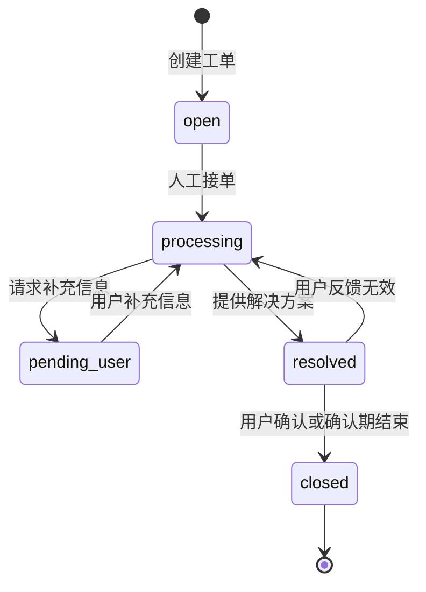

# 工单状态机

## 1. 设计目标

工单状态机用于描述人工处理流程。聊天会话与工单是两个生命周期不同的对象：用户退出聊天不会自动解决或关闭工单。

## 2. 状态定义

| 状态编码 | 展示名称 | 类型 | 含义 |
|---|---|---|---|
| `open` | 待受理 | 等待态 | 工单已创建，等待人工团队接单 |
| `processing` | 处理中 | 进行态 | 人工客服正在处理 |
| `pending_user` | 待用户补充 | 等待态 | 缺少必要信息，等待用户补充 |
| `resolved` | 已解决 | 待确认态 | 客服认为已解决，仍允许用户在确认期内反馈 |
| `closed` | 已关闭 | 终态 | 用户确认解决或按明确规则正式结束 |

## 3. 正常与补充流程



`pending_user` 是可选分支，不是每张工单都必须经过。

## 4. 高风险工单流程

高风险工单创建后不得进入普通队列：

```text
创建工单
→ 立即分派高风险人工团队
→ 等待人工接单
→ 处理中
```

需要分别记录和监控建单成功、分派成功、人工首次响应时间和超时未接单。AI 只负责识别风险、收集必要证据和升级，不提供诊断或治疗建议。

## 5. 解决、关闭与重新处理

- `resolved` 表示客服认为问题已经解决，但尚未成为不可变更的终态。
- 用户在确认期内反馈无效时，允许 `resolved -> processing`，并记录 `reopened` 事件和原因。
- `closed` 是终态，不允许直接回到 `processing`。
- 已关闭问题需要继续处理时，应创建关联原工单的新工单；如设计管理员重新开启能力，必须使用专门操作并保留完整审计记录。

## 6. 会话退出与关闭原因

- 用户退出聊天只结束或中断 ChatSession，不自动改变 Ticket 状态。
- 工单仍按当前人工流程继续处理。
- 后续因用户取消、长期失联或超时规则关闭时，必须记录结构化 `closure_reason`。
- “用户失联关闭”不得计入“问题成功解决”，避免虚高解决率。

## 7. 状态事件记录

每次状态变化写入 TicketEvent，至少包括：

```text
ticket_id
event_type
operator_user_id
from_status
to_status
event_detail
created_at
trace_id
```

状态表示工单当前所处阶段，事件记录状态为什么以及由谁发生变化。
