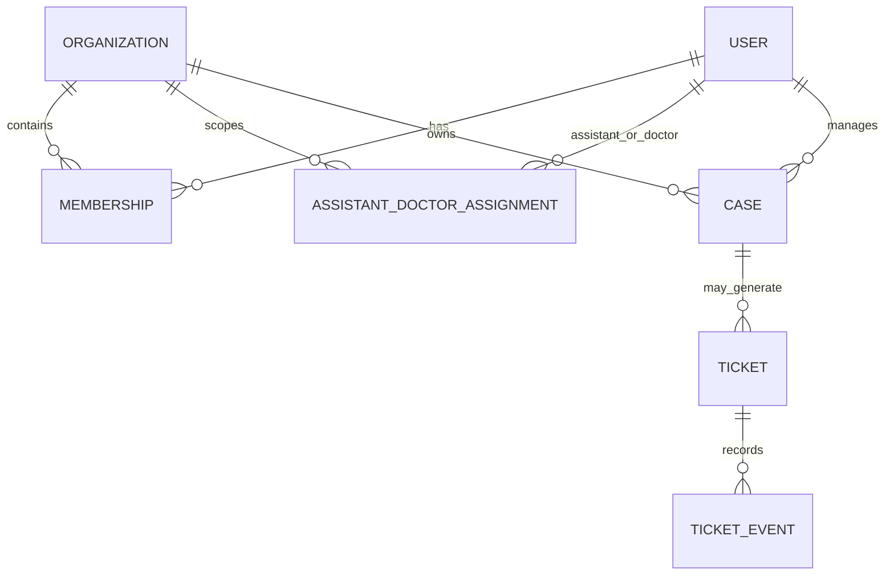

# 数据模型与权限基础

## 1. 文档状态

- 阶段：阶段 2，数据与契约
- 数据性质：全部为作品集模拟数据
- 当前范围：实体关系、数据归属和病例查询权限基础
- 暂不包含：最终 SQL、API 契约、Token 结构和完整权限矩阵

## 2. 设计原则

1. 角色决定用户在机构中能做什么。
2. 任职状态和有效期决定用户当前是否具有该机构的访问资格。
3. 历史数据归属、历史业务关系和当前访问权限分别管理。
4. Dify 或请求正文传入的 `user_id`、`doctor_id` 不能作为可信身份依据。
5. 病例查询必须在后端完成机构、角色、授权和对象归属校验。

## 3. 核心实体

### 3.1 User

表示可以登录或参与业务处理的人，包括医生、助理、客服和管理员。

| 字段 | 含义 |
|---|---|
| `user_id` | 用户唯一标识 |
| `display_name` | 模拟显示名称 |
| `account_status` | `active`、`frozen`、`disabled` |
| `created_at` | 创建时间 |
| `updated_at` | 更新时间 |

用户的机构角色不直接固化在 User 中，由 Membership 表达，以支持一名用户在不同机构拥有不同角色。

### 3.2 Organization

| 字段 | 含义 |
|---|---|
| `organization_id` | 机构唯一标识 |
| `organization_code` | 机构业务编码 |
| `organization_name` | 机构名称 |
| `status` | `active`、`suspended`、`closed` |
| `created_at` | 创建时间 |
| `updated_at` | 更新时间 |

医生、助理和病例是与机构关联的对象，不是机构表中的字段。

### 3.3 Membership

表示用户与机构之间的一段任职关系。User 与 Organization 是多对多关系。

| 字段 | 含义 |
|---|---|
| `membership_id` | 任职关系唯一标识 |
| `user_id` | 用户标识 |
| `organization_id` | 机构标识 |
| `role` | `doctor`、`assistant`、`support`、`admin` |
| `status` | `active`、`inactive` |
| `valid_from` | 任职开始时间 |
| `valid_to` | 任职结束时间，在职时可为空 |
| `created_at` | 创建时间 |
| `updated_at` | 更新时间 |

离职时不删除 Membership，而是将其置为 `inactive` 并填写 `valid_to`，保留审计和追溯能力。

### 3.4 AssistantDoctorAssignment

表示某机构内助理对医生病例的明确授权。

| 字段 | 含义 |
|---|---|
| `assignment_id` | 授权唯一标识 |
| `organization_id` | 授权生效的机构 |
| `assistant_user_id` | 助理用户标识 |
| `doctor_user_id` | 医生用户标识 |
| `status` | `active`、`revoked`、`expired` |
| `valid_from` | 授权开始时间 |
| `valid_to` | 授权结束时间 |
| `created_at` | 创建时间 |
| `updated_at` | 更新时间 |

授权不能跨机构继承。医生或助理离职后，即使 Assignment 尚未清理，Membership 校验也会阻止继续访问。

### 3.5 Case

| 字段 | 含义 |
|---|---|
| `case_id` | 病例唯一标识和查询编号 |
| `organization_id` | 病例数据所属机构 |
| `primary_doctor_user_id` | 当前主治医生，可重新分配 |
| `subject_ref` | 脱敏后的模拟患者标识 |
| `status` | 病例当前状态 |
| `created_at` | 创建时间 |
| `updated_at` | 更新时间 |

病例后续还需要状态时间线，具体状态机在本阶段的后续步骤定义。

### 3.6 Ticket

工单可以关联病例，也可以用于不涉及病例的产品咨询、系统故障或投诉，因此 `case_id` 可为空。

| 字段 | 含义 |
|---|---|
| `ticket_id` | 工单唯一标识 |
| `ticket_type` | 工单类型 |
| `priority` | `P0`、`P1`、`P2` |
| `status` | 工单当前状态 |
| `organization_id` | 所属机构 |
| `reporter_user_id` | 发起人 |
| `case_id` | 关联病例，可为空 |
| `assignee_user_id` | 当前处理人，可为空 |
| `summary` | 问题摘要 |
| `description` | 结构化问题描述 |
| `evidence` | 模拟证据引用，不保存真实医疗数据 |
| `risk_level` | 风险等级 |
| `source` | `dify`、`web`、`api` 等来源 |
| `idempotency_key` | 防止重试产生重复工单 |
| `created_at` | 创建时间 |
| `updated_at` | 更新时间 |
| `resolved_at` | 解决时间，可为空 |

### 3.7 TicketEvent

Ticket 保存当前状态，TicketEvent 保存工单发生过的变化。

| 字段 | 含义 |
|---|---|
| `event_id` | 事件唯一标识 |
| `ticket_id` | 所属工单 |
| `event_type` | 创建、分派、补充证据、状态变更、解决等 |
| `operator_user_id` | 操作人 |
| `from_status` | 变更前状态，可为空 |
| `to_status` | 变更后状态，可为空 |
| `event_detail` | 事件详情 |
| `created_at` | 发生时间 |

## 4. 实体关系

## 5. 助理查询病例的授权规则

助理查询某个病例时，以下条件必须同时满足：

1. Token 对应的真实用户账号处于 `active` 状态。
2. 助理在病例所属机构有有效 Membership。
3. 该 Membership 的角色为 `assistant`。
4. 助理与病例当前主治医生存在同一机构内的有效 Assignment。
5. 病例、医生和助理属于同一机构上下文。
6. 机构和病例当前状态允许查询。

任何条件不满足都拒绝返回病例内容。对外错误信息不区分“病例不存在”和“用户无权限”，避免泄露病例是否存在；详细原因只写入审计日志。

## 6. 医生离职规则

- 历史主治关系不删除，用于业务追溯和审计。
- 历史病例仍归原机构所有。
- 医生在原机构的 Membership 失效，原机构病例访问权限随之失效。
- 原机构可以将进行中的病例重新分配给其他在职医生。
- 医生加入新机构后，新机构不能查看其在旧机构处理的病例。
- 离职、权限撤销和病例重新分配都应记录审计事件。

## 7. 下一步

下一学习单元将把以上概念模型转换为：

1. 可执行的表结构和字段约束；
2. 病例与工单状态机；
3. 正常、越权、离职、冻结和跨机构 Mock 数据组合。
