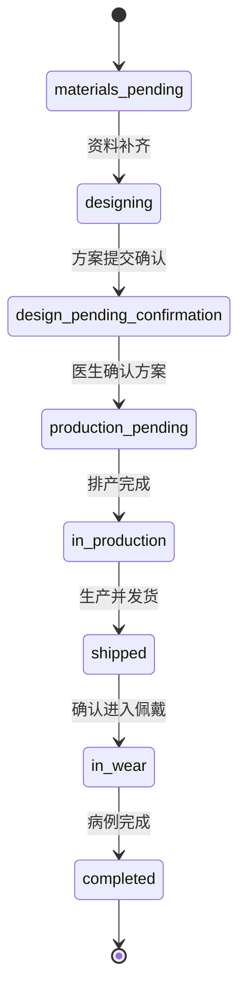

# 病例状态机

## 1. 设计目标

病例状态机用于限制病例只能按照合法业务流程变化，并为状态查询、异常处理和审计提供确定性数据。LLM 只能解释接口返回的状态，不能自行推测或修改病例状态。

## 2. 状态定义

| 状态编码 | 展示名称 | 类型 | 含义 |
|---|---|---|---|
| `materials_pending` | 资料待提交 | 进行态 | 所需资料尚未提交完整 |
| `designing` | 方案设计中 | 进行态 | 已收到完整资料，正在设计方案 |
| `design_pending_confirmation` | 方案待确认 | 等待态 | 方案等待医生确认或提出修改 |
| `production_pending` | 待排产 | 等待态 | 方案已确认，等待进入生产 |
| `in_production` | 生产中 | 进行态 | 产品正在生产 |
| `shipped` | 已发货 | 进行态 | 产品已发出，尚未进入佩戴阶段 |
| `in_wear` | 佩戴中 | 进行态 | 已进入佩戴和复诊阶段 |
| `paused` | 已暂停 | 异常态 | 流程因资料、方案或其他问题暂停 |
| `completed` | 已完成 | 终态 | 当前病例流程已完成 |
| `cancelled` | 已取消 | 终态 | 当前病例流程已正式终止 |

## 3. 正常主流程



## 4. 异常与返工流转

| 当前状态 | 业务事件 | 下一状态 | 说明 |
|---|---|---|---|
| `materials_pending` | 资料补齐 | `designing` | 动作完成后必须离开资料待提交状态 |
| `design_pending_confirmation` | 医生要求修改 | `designing` | 退回设计并保留修改事件 |
| `in_production` | 发现异常并暂停 | `paused` | 记录暂停原因和暂停前状态 |
| `paused` | 问题解决并批准恢复 | `in_production` | 仅适用于从生产中暂停的本次场景 |
| 任一非终态 | 正式取消 | `cancelled` | 记录取消原因和操作人 |

通用暂停需要额外记录 `previous_status` 或独立状态事件，恢复时回到经过规则允许的目标状态，不能只凭 `paused` 推测恢复位置。

## 5. 禁止流转

- `designing -> in_production`：跳过方案确认和排产。
- `completed -> designing`：已完成是终态，不能直接回退。
- `cancelled -> in_production`：已取消是终态，不能直接恢复生产。
- 任意未授权的跨阶段跳转：必须由明确业务动作和权限规则触发。

确需重新设计或重新治疗时，应创建新的病例、追加阶段或专门的重新开启流程，不能覆盖原有历史。

## 6. 状态变更记录要求

每次状态变化至少记录：

```text
case_id
from_status
to_status
event_type
operator_user_id
reason
created_at
trace_id
```

状态表示“当前在哪里”，事件表示“发生了什么”。当前状态保存在 Case，完整变化过程由后续定义的 CaseStatusEvent 保存。
