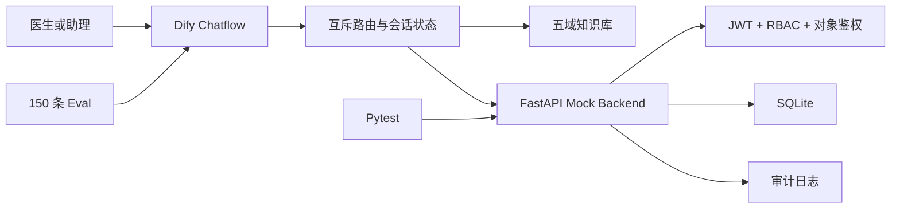

# 技术架构

## 1. 当前实现



## 2. 组件职责

- Dify：输入归一化、风险硬规则、意图路由、多轮澄清、RAG 和工具编排。
- FastAPI：可信身份、病例权限、确定性状态查询、幂等建单、结构化错误和故障注入。
- SQLite：作品集本地持久化；表结构保留向 PostgreSQL 迁移路径。
- Eval：验证路由、工具、权限、高风险转人工、知识质量和安全边界。
- 审计日志：记录 `trace_id`、操作者、对象、动作、结果和内部拒绝原因。

## 3. 关键请求链路

### 病例查询

```text
用户问题
→ Dify 识别病例查询
→ 缺少病例号时进行一次澄清
→ 携带 JWT 调用 GET /v1/cases/{case_id}
→ Backend 校验账号、机构、Membership、角色和对象权限
→ 返回最小病例状态或统一安全提示
→ Dify 生成单一用户输出
```

### 高风险升级

```text
用户描述异常
→ 高风险硬规则优先命中
→ AI 收集最小必要证据，不诊断
→ 携带 Idempotency-Key 调用 POST /v1/tickets
→ Backend 创建 P0 工单并立即分派高风险团队
→ 返回工单号和下一步
```

## 4. 技术取舍

- SQLite 便于作品集本地运行；生产建议迁移 PostgreSQL，并采用迁移工具管理 schema。
- Mock 登录允许为冻结用户生成 Token，以验证资源接口的纵深防御；真实系统应在认证阶段直接阻断冻结账号。
- 故障注入默认关闭，仅测试环境通过环境变量开启。
- 当前 API 为只读病例查询，不开放 AI 修改病例或临床数据。
